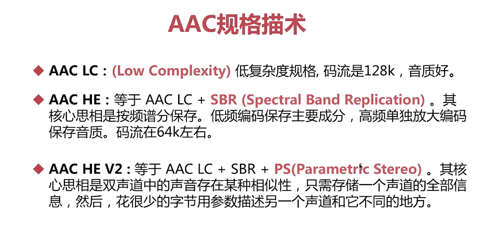
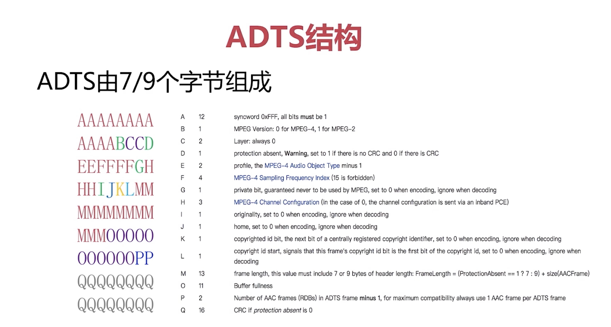

# Chapter 7
频域遮蔽效应
时域遮蔽效应

## 熵编码
1. 哈夫曼编码


2. 算术编码
3. 香农编码


---
Opus很多即时通讯的软件会用
Speex 包括了回音消除

G.711不适合做音频编解码
AAC是用于取代mp3的,用的最广的,压缩率高,保真吕高 

---


---
# ADTS格式


---


```bash
ffmpeg -i xxx.mp4 -vn -c:a libfdk_aac -ar 44100 -channels 2 -profile:a aac_he_v2 3.aac
```

### 命令解析：
1. **`ffmpeg`**：
   - FFmpeg 是一个强大的多媒体处理工具，用于音视频文件的转换、录制、处理。

2. **`-i xxx.mp4`**：
   - 指定输入文件 `xxx.mp4`，这表示将从 `xxx.mp4` 中提取音视频信息。

3. **`-vn`**：
   - 表示忽略视频流（`-vn` 意为 `no video`），只处理音频部分。

4. **`-c:a libfdk_aac`**：
   - 指定音频编码器为 `libfdk_aac`，它是一个高质量的 AAC（Advanced Audio Codec）音频编码器。

5. **`-ar 44100`**：
   - 指定音频采样率为 44100 Hz。这是常见的 CD 音频采样率，确保输出音频质量适中。

6. **`-channels 2`**：
   - 指定输出音频为双声道（立体声）。

7. **`-profile:a aac_he_v2`**：
   - 指定 AAC 编码配置为 HE-AAC v2（High Efficiency AAC Version 2），这是一个用于低比特率音频编码的配置，能够在较低比特率下实现高质量。

8. **`3.aac`**：
   - 指定输出文件名称为 `3.aac`，最终的音频将保存到这个文件中。

### 整体作用：
- 这条命令会从 `xxx.mp4` 中提取音频部分，编码为 HE-AAC v2 格式（适用于低比特率高质量音频需求），采样率为 44100 Hz，双声道，输出文件保存为 `3.aac`。