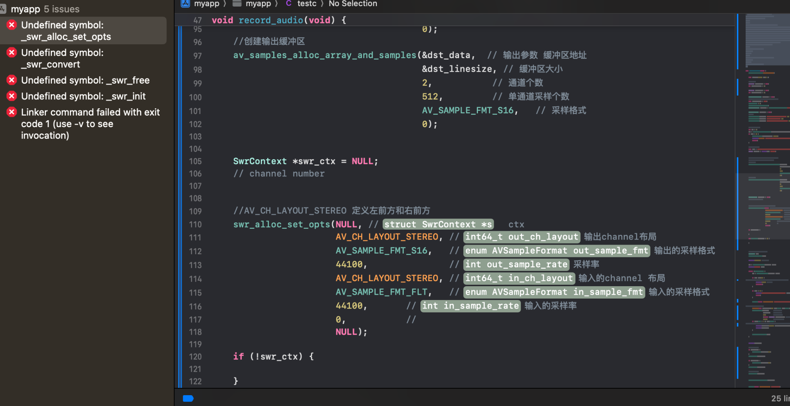
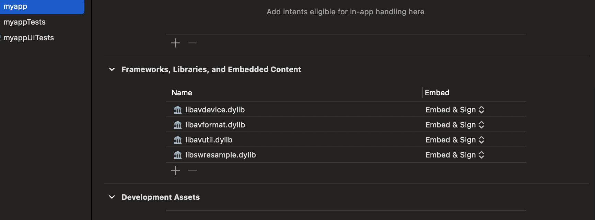

# Chapter8

## 问题一: 参数ac不适用
ac 参数在ffmpeg 新版本中已经被淘汰了， 该用下面这个-ch_layout [mono \ stereo]

```bash
ffplay -ch_layout stereo -ar 48000 -f s16le /Users/froginwarmwater/Documents/audio_dev/audio.pcm

ffplay -ch_layout stereo -ar 44100 -f f32le /Users/froginwarmwater/Documents/audio_dev/audio.pcm

```


其中ffplay -f s16le 中的 s16le 表示输入音频文件是 16 位有符号小端序的 PCM 数据。这是最常见的音频采样格式之一，尤其适用于原始音频文件或未压缩的高质量音频数据。

## 问题二: swr_init函数找不到

Frameworks 里没有加，需要在General -> Frameworks, Libraries, and Embedded Content 中引入需要的库文件。




## 问题三: 输出有问题
https://coding.imooc.com/learn/questiondetail/lz14NXLqAAy6K2p9.html

问题描述:
重采样之后播放, 能听清但是声音变的很快

我的播放命令:
ffplay -ar 44100 -ac 2 -f s16le ./audio.pcm

我的其他尝试:

使用命令ffplay -ar 44100 -ac 2 -f f32le ./audio.pcm
播放速度很快,听不清
将单通道采样数改为 512. 使用上面两个命令播放,也完全听不清.

```
已经解决， 解决思路如下。
1. 按照老师说的，测试录制原始数据播放是否正常：经过测试是不正常的。

2. 猜测：我的电脑设备数据和老师的设备数据不一致导致的。

3. 验证：首先查看电脑可用的设备：ffmpeg -f avfoundation -list_devices true -i ''
    结果：[AVFoundation indev @ 0x14c004440] AVFoundation video devices:
[AVFoundation indev @ 0x14c004440] [0] FaceTime HD Camera
[AVFoundation indev @ 0x14c004440] [1] Capture screen 0
[AVFoundation indev @ 0x14c004440] AVFoundation audio devices:
[AVFoundation indev @ 0x14c004440] [0] MacBook Air麦克风
[AVFoundation indev @ 0x14c004440] [1] Filmage 聚集设备
[AVFoundation indev @ 0x14c004440] [2] FreeBuds 3
[AVFoundation indev @ 0x14c004440] [3] BlackHole 16ch

4. 选择设备0， 用默认的ffmpeg录制命令录制：ffmpeg -f avfoundation -i :0 out.wav

5. 播放该录音(我的mac和他的一样)： ffplay ./out.wav
  Stream #0:0: Audio: pcm_s16le ([1][0][0][0] / 0x0001), 48000 Hz, 1 channels, s16, 768 kb/s
   5.92 M-A:  0.000 fd=   0 aq=  104KB vq=    0KB sq=    0B f=0/0

6. 发现采样率， 通道数， 数据格式和老师告诉我们的都不一样

7. 一个一个尝试， 我的设备将采样率设置为48000， 通道数设置为1， 数据格式设置为f32le 就播放正常

8. 猜测 mac的麦克风只有一个，所以默认是单通道。
```